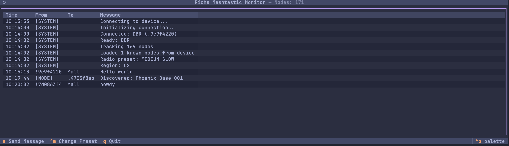

# Meshtastic Terminal

A terminal interface for chatting via Meshtastic.



## Overview

Meshtastic Terminal is a modern terminal UI for real-time communication over Meshtastic mesh networks. Monitor messages, send texts, and manage your mesh network directly from your terminal.

## Features

- Real-time message display with timestamps
- Node discovery tracking
- Radio configuration display (preset/region)
- Live node counter in header, plus other stats
- Press 's' to send a message
- Press 'd' to send a direct message (select from a list of discovered nodes)
- Press 'q' to quit
- Automatically reconnects if the device is disconnected / your computer sleeps
- Ability to switch radio presets/modes and frequency slots on the fly
- Node list - press ctrl+n to view the list of discovered nodes / view details
- Theme support - press ctrl+p to open the theme selector

## Prerequisites

- Python 3.8 or higher
- A Meshtastic device connected via USB/serial
- [uv](https://github.com/astral-sh/uv) - Fast Python package installer and resolver

## Quickstart

If you have `uv` installed, you can run Meshtastic Terminal directly without cloning:

```bash
uvx --from "git+https://github.com/richstokes/meshtastic_terminal.git" meshtastic-tui
```

This will automatically download, install dependencies, and run the application in one command!

## Installation

### 1. Install uv (if not already installed)

On macOS/Linux:

```bash
curl -LsSf https://astral.sh/uv/install.sh | sh
```

Or using Homebrew:

```bash
brew install uv
```

For other installation methods, see [uv documentation](https://github.com/astral-sh/uv).

### 2. Clone or download this repository

```bash
gh repo clone richstokes/meshtastic_terminal
cd meshtastic_terminal
```

### 3. Install dependencies with uv

```bash
uv sync
```

This will:

- Create a virtual environment (if needed)
- Install all required dependencies
- Make the scripts available for execution

## Usage

### Running Meshtastic Terminal

The recommended way to run the terminal interface is using `uv run`:

```bash
uv run python meshtastic_tui.py
```

OR to auto-detect and connect to the first detected Meshtastic device:

```bash
uv run python meshtastic_tui.py -a
```

## Contributing

Feel free to submit issues or pull requests to improve these scripts!
